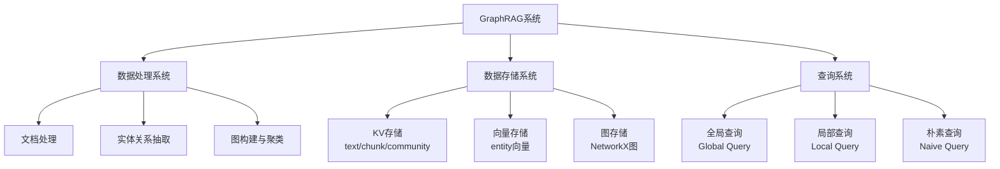
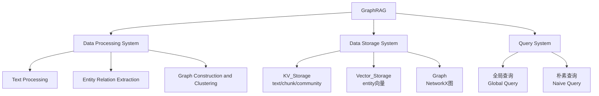
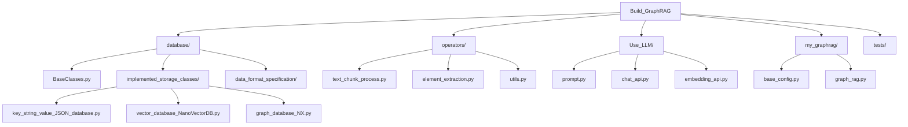
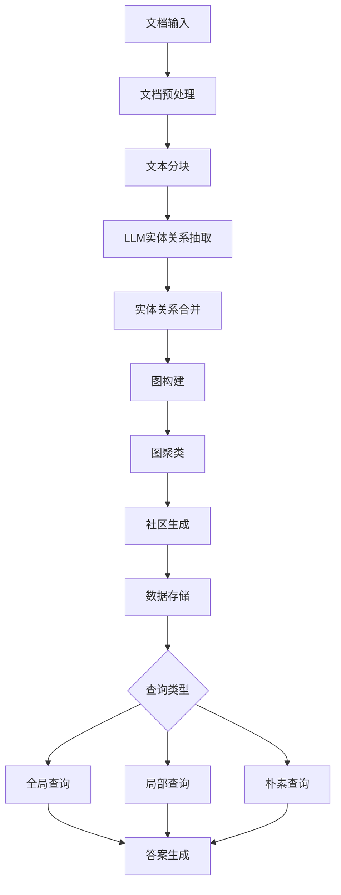
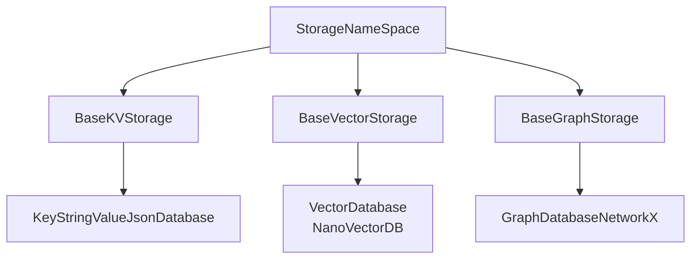
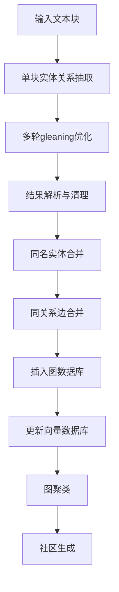
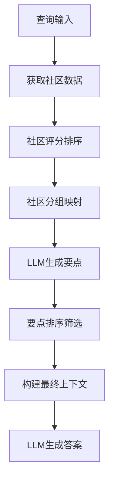
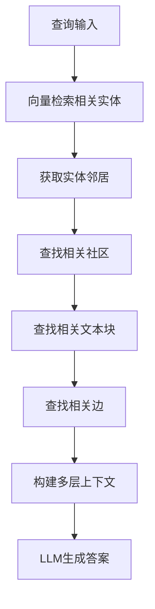
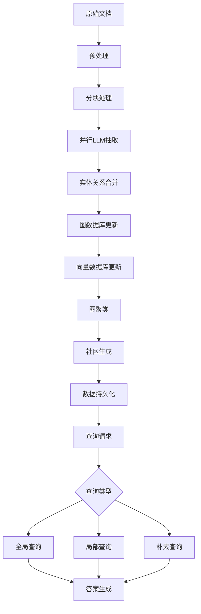

# GraphRAG复现架构文档

## 一、整体架构

### 1.1 系统架构概览





### 1.2 项目文件架构



### 1.3 核心数据流程



## 二、核心子系统详解

### 2.1 数据存储层

#### 2.1.1 存储抽象层次



#### 2.1.2 StorageNameSpace（存储命名空间基类）

**职责**：所有存储类的基础抽象，定义通用字段和生命周期回调

**核心字段**：
```python
name_space: str           # 存储命名空间标识
global_config: dict       # 全局配置字典
```

**生命周期接口**：
```python
async def index_start_callback(self) -> None:
    """索引开始时的初始化操作"""
    
async def index_done_callback(self) -> None:
    """索引完成时的持久化操作"""
    
async def query_done_callback(self) -> None:
    """查询完成时的清理操作"""
```

#### 2.1.3 BaseKVStorage（键值存储基类）

**职责**：管理Key:String -> Value:JSON格式的数据存储

**核心接口**：
```python
async def get_all_keys(self) -> List[str]:
    """获取所有键"""

async def get_data_by_id(self, id: str) -> Union[T, None]:
    """根据ID获取单条数据"""

async def get_data_by_ids(self, ids: List[str], fields: Set[str]) -> List[Union[T, None]]:
    """批量获取数据，可指定字段"""

async def get_keys_to_be_inserted(self, external_keys: List[str]) -> Set[str]:
    """筛选需要插入的新键"""

async def update_or_insert(self, data: Dict[str, T]) -> None:
    """批量插入或更新数据"""

async def clear_all(self) -> None:
    """清空所有数据"""
```

**存储内容**：
- `original_docs`: 原始文档内容
- `chunks`: 文本分块数据  
- `community_reports`: 社区报告

#### 2.1.4 BaseVectorStorage（向量存储基类）

**职责**：管理向量化数据的存储和相似性查询

**核心配置**：
```python
embedding_func: EmbeddingFunction    # 向量化函数
meta_fields: Set[str]               # 需要存储的元数据字段
```

**核心接口**：
```python
async def query(self, query: str, top_k: int) -> List[Dict]:
    """向量相似性查询，返回top_k个最相似结果"""

async def update_or_insert(self, data: Dict[str, Dict]) -> None:
    """插入或更新向量数据"""
```

**存储内容**：
- `entity_vectors`: 实体向量（用于局部查询）
- `chunk_vectors`: 文本块向量（用于朴素查询）

#### 2.1.5 BaseGraphStorage（图存储基类）

**职责**：管理图结构数据，包括节点、边和社区

**节点操作接口**：
```python
async def check_node(self, node_id: str) -> bool:
async def get_node_data_by_id(self, node_id: str) -> Union[Dict, None]:
async def get_node_degree(self, node_id: str) -> Union[int, None]:
async def update_or_insert_node(self, node_id: str, node_data: Dict) -> None:
```

**边操作接口**：
```python
async def check_edge(self, source_id: str, target_id: str) -> bool:
async def get_edge_data_by_id(self, source_id: str, target_id: str) -> Union[Dict, None]:
async def get_all_edges_from_this_node(self, node_id: str) -> Union[List[Tuple[str, str]], None]:
async def update_or_insert_edge(self, source_id: str, target_id: str, edge_data: Dict) -> None:
```

**图算法接口**：
```python
async def clustering(self, algorithm: str) -> None:
    """图聚类，支持leiden算法"""

async def community_schema(self) -> Dict[str, SingleCommunityFormat_NoReport]:
    """生成层次化社区结构"""
```

### 2.2 文档处理系统

#### 2.2.1 文档预处理

**模块**：`operators/text_chunk_process.py`

**功能流程**：
```python
def process_docs_to_new_format(docs: List[str]) -> Dict[str, Dict]:
    """
    输入: List[str] - 原始文档列表
    输出: Dict[str, Dict] - 格式化文档字典
    格式: {"doc-{hash}": {"content": "文档内容..."}}
    """

def split_texts_into_chunks(texts: Dict[str, Dict], config: Dict) -> Dict[str, Dict]:
    """
    输入: 格式化文档字典
    输出: 文本块字典
    格式: {"chunk-{hash}": {
        "content": "块内容",
        "tokens": 1200,
        "doc_id": "doc-{hash}",
        "chunk_order_index": 0
    }}
    """
```

**配置参数**：
- `chunk_token_size`: 文本块大小（默认1200）
- `overlap_token_size`: 重叠大小（默认100）
- `chunk_func`: 分块函数（默认按token大小分块）

### 2.3 实体关系抽取系统

#### 2.3.1 抽取流程

**模块**：`operators/element_extraction.py`

**主要函数**：`extract_entities_and_relations`

**处理流程**：


**核心处理函数**：

1. **单块抽取**：
```python
async def process_single_chunk(chunk_key: str, chunk_content: str, 
                               llm_client, prompt: str, max_gleaning_time: int) -> Dict:
    """
    对单个文本块进行实体关系抽取
    返回: {"entity": [entity_list], "relationship": [relation_list]}
    """
```

2. **多轮优化**：
```python
async def gleaning(max_gleaning_time: int, llm_client, continue_prompt, 
                   history, if_loop_prompt, answer_last_time) -> str:
    """
    多轮gleaning，逐步完善抽取结果
    """
```

3. **实体合并**：
```python
def merge_nodes_and_edges(extracted_result: List[Dict]) -> Tuple[Dict, Dict]:
    """
    合并同名实体和同关系边
    返回: (合并后的节点字典, 合并后的边字典)
    """
```

#### 2.3.2 数据格式

**实体格式**：
```python
{
    "entity_name": "EBENEZER SCROOGE",
    "entity_type": "person", 
    "entity_description": "主人公，吝啬老人...",
    "entity_source_chunk": "chunk-{hash}"
}
```

**关系格式**：
```python
{
    "source_node_id": "EBENEZER SCROOGE",
    "target_node_id": "BOB CRATCHIT", 
    "edge_description": "雇佣关系",
    "edge_source_chunk": "chunk-{hash}",
    "weight": 1.5
}
```

### 2.4 图构建与社区系统

#### 2.4.1 图存储实现

**类**：`GraphDatabaseNetworkX`
**基础**：NetworkX图库

**核心特性**：
- 自动加载/保存GraphML文件
- 支持leiden层次聚类
- 稳定的连通分量处理
- 社区结构生成

**文件持久化**：
```python
# 文件路径格式
self._graph_file = os.path.join(
    self.global_config["working_dir"], 
    f'graph_{self.name_space}.graphml'
)
```

#### 2.4.2 社区聚类

**算法**：Hierarchical Leiden
**实现**：`graspologic.partition.hierarchical_leiden`

**聚类流程**：
```python
async def _leiden_clustering(self) -> None:
    # 1. 获取最大连通分量
    subgraph = self.stable_largest_connected_component(self._graph)
    
    # 2. 执行层次聚类
    partitions = hierarchical_leiden(
        subgraph,
        max_cluster_size=self.global_config["max_graph_cluster_size"],
        random_seed=self.global_config["graph_cluster_seed"]
    )
    
    # 3. 将聚类结果写入节点属性
    for node_id, clusters in cluster_map.items():
        self._graph.nodes[node_id]['clusters'] = json.dumps(clusters)
```

**社区数据格式**：
```python
{
    "level": 0,                    # 层次级别
    "title": "Cluster 17",        # 社区标题
    "nodes": ["NODE1", "NODE2"],  # 包含的节点
    "edges": [["NODE1", "NODE2"]], # 包含的边
    "chunk_ids": ["chunk-1"],     # 来源文本块
    "occurrence": 0.8,            # 出现频率
    "sub_communities": ["18", "19"] # 子社区ID
}
```

### 2.5 查询系统

#### 2.5.1 查询模式对比

| 查询模式 | 数据源 | 适用场景 | 特点 |
|---------|--------|---------|------|
| 全局查询 | 社区报告 | 高层次概览问题 | 覆盖面广，抽象层次高 |
| 局部查询 | 实体+社区+文本块 | 具体实体相关问题 | 精确性高，上下文丰富 |
| 朴素查询 | 文本块向量 | 简单事实查找 | 直接快速，类似传统RAG |

#### 2.5.2 全局查询流程



#### 2.5.3 局部查询流程



## 三、配置系统

### 3.1 BaseConfig配置类

**核心配置项**：

```python
@dataclass
class BaseConfig:
    # 工作目录
    working_dir: str = f"./nano_graphrag_cache_{datetime.now().strftime('%Y-%m-%d-%H:%M:%S')}"
    
    # 文本处理
    chunk_token_size: int = 1200
    overlap_token_size: int = 100
    
    # 向量化配置
    embedding_func: SentenceTransformer = SentenceTransformer("BAAI/bge-small-zh-v1.5")
    embedding_dim: int = 512
    embedding_batch_size: int = 16
    
    # 图配置
    max_graph_cluster_size: int = 10
    graph_cluster_seed: int = 0xDEADBEEF
    
    # LLM配置
    best_model_func: callable = QwenChatAPI(model="qwen3")
    max_gleaning_time: int = 1
    
    # 查询功能开关
    enable_local_query: bool = True
    enable_global_query: bool = True
    enable_naive_query: bool = True
```

### 3.2 QueryParam查询参数

```python
@dataclass
class QueryParam:
    mode: Literal["local", "global", "naive"] = "global"
    only_need_context: bool = False
    response_type: str = "Multiple Paragraphs"
    level: int = 2
    top_k: int = 20
    
    # 朴素查询参数
    naive_max_token_for_text_unit: int = 12000
    
    # 局部查询参数  
    local_max_token_for_text_unit: int = 4000
    local_max_token_for_local_context: int = 4800
    local_max_token_for_community_report: int = 3200
    
    # 全局查询参数
    global_max_consider_community: float = 512
    global_max_token_for_community_report: int = 16384
```

## 四、数据格式规范

### 4.1 核心数据结构

#### 4.1.1 文档格式
```python
TextFormat = {
    "content": str  # 文档内容
}
```

#### 4.1.2 文本块格式
```python
ChunkFormat = {
    "content": str,           # 块内容
    "tokens": int,            # token数量
    "doc_id": str,            # 所属文档ID
    "chunk_order_index": int  # 在文档中的顺序
}
```

#### 4.1.3 节点格式
```python
NodeFormat = {
    "type": str,              # 实体类型
    "description": str,       # 实体描述
    "source_chunk_ids": str   # 来源块ID（SEP分隔）
}
```

#### 4.1.4 边格式
```python
EdgeFormat = {
    "weight": float,          # 权重
    "description": str,       # 关系描述
    "source_chunk_ids": str,  # 来源块ID（SEP分隔）
    "order": int             # 顺序
}
```

#### 4.1.5 社区格式

**无报告版本**：
```python
Community_Format_without_Report = TypedDict(
    "Community_Format_without_Report",
    {
        "level": int,
        "title": str,
        "nodes_id": List[str],
        "edges_id": List[Tuple[str, str]],
        "chunks_id": List[str],
        "occurrence": float,
        "sub_communities": List[str],
    },
)
```

**带报告版本**：
```python
Community_Format_with_Report = TypedDict(
    "Community_Format_with_Report",
    {
        "report_string": str,
        "report_json": dict,
        **Community_Format_without_Report.__annotations__,
    },
)
```

## 五、LLM集成

### 5.1 LLM接口抽象

**聊天接口**：`QwenChatAPI`
**嵌入接口**：`QwenEmbeddingAPI`

### 5.2 提示词管理

**核心提示词类型**：
- `entity_extraction`: 实体关系抽取
- `entity_continue_extraction`: 继续抽取
- `entity_if_loop_extraction`: 判断是否继续
- `summarize_entity_descriptions`: 实体描述摘要

## 六、系统集成与流程

### 6.1 GraphRAG主类

**职责**：系统入口，协调各子系统协作

**核心方法**：
```python
class GraphRAG:
    def insert(self, docs) -> None:
        """同步插入接口"""
        
    async def async_insert(self, docs) -> None:
        """异步插入流程：文档处理 -> 抽取 -> 图构建 -> 存储"""
        
    def query(self, query: str, param: QueryParam) -> str:
        """查询接口（待实现）"""
```

### 6.2 完整数据流



### 6.3 错误处理与容错

**异步处理**：使用`asyncio.gather`并行处理多个文本块
**错误恢复**：LLM调用失败时的重试机制
**数据一致性**：通过事务性操作保证数据完整性

## 七、性能优化

### 7.1 并发处理
- 文本块并行抽取
- 向量化批处理
- 异步数据库操作

### 7.2 缓存机制
- LLM响应缓存
- 嵌入结果缓存
- 图计算结果缓存

### 7.3 内存管理
- 分批处理大文档
- 及时释放临时数据
- 流式处理向量数据

## 八、测试与调试

### 8.1 测试辅助工具

提供`GraphTestHelper`类用于：
- 加载已有图数据进行测试
- 图结构分析和统计
- 节点关系查询
- 可视化子图生成

### 8.2 调试功能
- 详细的日志记录
- 中间结果检查点
- 图数据可视化
- 性能监控统计

---

**注意**：本文档基于当前代码实现状态编写，随着系统功能扩展可能需要进一步更新。
